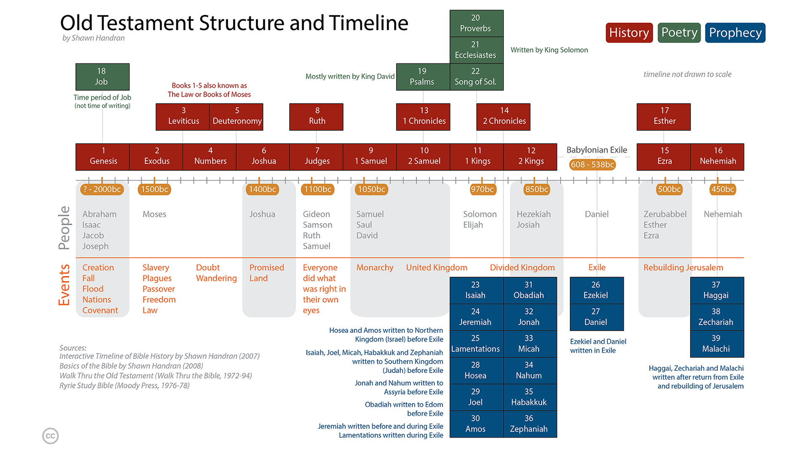
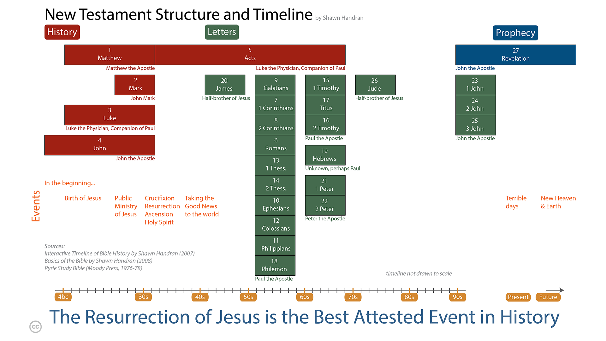

Provides a better understanding of when the events described in the Bible occurred in history. 
Available in over a dozen languages.
{:.note}

{:.lead width="800" height="100" loading="lazy"}
Old Testament Structure and Timeline
{:.figcaption}

{:.lead width="800" height="100" loading="lazy"}
New Testament Structure and Timeline
{:.figcaption}

* BST in English
* Translated versions
* BST Source Files
{:toc}

# BST in English
[PDF](../assets/pdfs/BibleStructureTimeline.pdf){:.heading.flip-title} {{ site.data.strings.large_separator }}
[PNG OT](../assets/img/hd/bstothd.png){:.heading.flip-title} {{ site.data.strings.large_separator }}
[PNG NT](../assets/img/hd/bstnthd.png){:.heading.flip-title} 

# Translated versions  
## العربية Arabic 
[PDF](../assets/pdfs/الترتيبالزمنيوالهيكليالكتابالمقدس.pdf){:.heading.flip-title} {{ site.data.strings.large_separator }}
[PNG OT](){:.heading.flip-title} {{ site.data.strings.large_separator }}
[PNG NT](){:.heading.flip-title} 

## Bahasa Indonesian
[PDF](../assets/pdfs/StrukturdanKronologiAlkitab_BahasaIndonesia.pdf){:.heading.flip-title} {{ site.data.strings.large_separator }}
[PNG OT](../assets/img/hd/bstothdbahasaindonesia.png){:.heading.flip-title} {{ site.data.strings.large_separator }}
[PNG NT](../assets/img/hd/bstnthdbahasaindonesia.png){:.heading.flip-title} 

## 简体中文 Chinese (Simplified)
[PDF](../assets/pdfs/圣经架构与时间表(简化字).pdf){:.heading.flip-title} {{ site.data.strings.large_separator }}
[PNG OT](../assets/img/hd/bstothdsimplified.png){:.heading.flip-title} {{ site.data.strings.large_separator }}
[PNG NT](../assets/img/hd/bstnthdsimplified.png){:.heading.flip-title} 

## 繁體中文 Chinese (Traditional)
[PDF](../assets/pdfs/聖經架構與時間表(繁體字).pdf){:.heading.flip-title} {{ site.data.strings.large_separator }}
[PNG OT](../assets/img/hd/bstothdtraditional.png){:.heading.flip-title} {{ site.data.strings.large_separator }}
[PNG NT](../assets/img/hd/bstnthdtraditional.png){:.heading.flip-title} 

## Chinese (Pinyin)
[PDF](../assets/pdfs/SimplifiedChinesePinyin.pdf){:.heading.flip-title} {{ site.data.strings.large_separator }}
[PNG OT](){:.heading.flip-title} {{ site.data.strings.large_separator }}
[PNG NT](){:.heading.flip-title} 

## Français French
[PDF](../assets/pdfs/StructureBibliqueEtChronologie.pdf){:.heading.flip-title} {{ site.data.strings.large_separator }}
[PNG OT](){:.heading.flip-title} {{ site.data.strings.large_separator }}
[PNG NT](){:.heading.flip-title} 

## Deutsch German
[PDF](../assets/pdfs/GliederungUndZeitleisteDerBibel.pdf){:.heading.flip-title} {{ site.data.strings.large_separator }}
[PNG OT](){:.heading.flip-title} {{ site.data.strings.large_separator }}
[PNG NT](){:.heading.flip-title} 

##  हिंदी भाषा Hindi
[PDF](../assets/pdfs/बाइबिलसंरचनाऔरसमयरेखा.pdf){:.heading.flip-title} {{ site.data.strings.large_separator }}
[PNG OT](){:.heading.flip-title} {{ site.data.strings.large_separator }}
[PNG NT](){:.heading.flip-title} 

## Magyar Hungarian
[PDF](../assets/pdfs/BibliaSzerkezeteEsIdorendje.pdf){:.heading.flip-title} {{ site.data.strings.large_separator }}
[PNG OT](){:.heading.flip-title} {{ site.data.strings.large_separator }}
[PNG NT](){:.heading.flip-title} 

## Italiano Italian
[PDF](../assets/pdfs/StrutturaELineaCronologicaDellaBibbia.pdf){:.heading.flip-title} {{ site.data.strings.large_separator }}
[PNG OT](){:.heading.flip-title} {{ site.data.strings.large_separator }}
[PNG NT](){:.heading.flip-title} 

##  日本語 Japanese
[PDF](../assets/pdfs/聖書の構造と時系列.pdf){:.heading.flip-title} {{ site.data.strings.large_separator }}
[PNG OT](../assets/img/hd/bstothdjapanese.png){:.heading.flip-title} {{ site.data.strings.large_separator }}
[PNG NT](../assets/img/hd/bstnthdjapanese.png){:.heading.flip-title} 

## 한국어 Korean
[PDF](../assets/pdfs/성경의구조와%20연대기.pdf){:.heading.flip-title} {{ site.data.strings.large_separator }}
[PNG OT](){:.heading.flip-title} {{ site.data.strings.large_separator }}
[PNG NT](){:.heading.flip-title} 

## Português Portugeuse
[PDF](../assets/pdfs/EstruturaBiblicaECronologia.pdf){:.heading.flip-title} {{ site.data.strings.large_separator }}
[PNG OT](){:.heading.flip-title} {{ site.data.strings.large_separator }}
[PNG NT](){:.heading.flip-title} 

## Русский Russian
[PDF](../assets/pdfs/БиблейскаяСтруктураиИсторическаяЛиния.pdf){:.heading.flip-title} {{ site.data.strings.large_separator }}
[PNG OT](){:.heading.flip-title} {{ site.data.strings.large_separator }}
[PNG NT](){:.heading.flip-title} 

## Español Spanish
[PDF](../assets/pdfs/EstructuraBiblicaYCronograma.pdf){:.heading.flip-title} {{ site.data.strings.large_separator }}
[PNG OT](){:.heading.flip-title} {{ site.data.strings.large_separator }}
[PNG NT](){:.heading.flip-title} 

## ภาษาไทย Thai
[PDF](../assets/pdfs/โครงสร้างและช่วงเวลาในพระคัมภีร์.pdf){:.heading.flip-title} {{ site.data.strings.large_separator }}
[PNG OT](){:.heading.flip-title} {{ site.data.strings.large_separator }}
[PNG NT](){:.heading.flip-title} 

## Tiếng Việt Vietnamese
[PDF](../assets/pdfs/VietnameseBST.pdf){:.heading.flip-title} {{ site.data.strings.large_separator }}
[PNG OT](){:.heading.flip-title} {{ site.data.strings.large_separator }}
[PNG NT](){:.heading.flip-title} 

# BST Source Files
Create your own translation of the Bible Structure and Timeline in Adobe Illustrator or Microsoft Publisher.

* [Illustrator](../assets/zip/Illustrator.zip){:.heading.flip-title} files (LTR format)  (2.1 MB zip)
* [Publisher](../assets/zip/Publisher.zip){:.heading.flip-title} files (RTL format)  (0.2 MB zip)