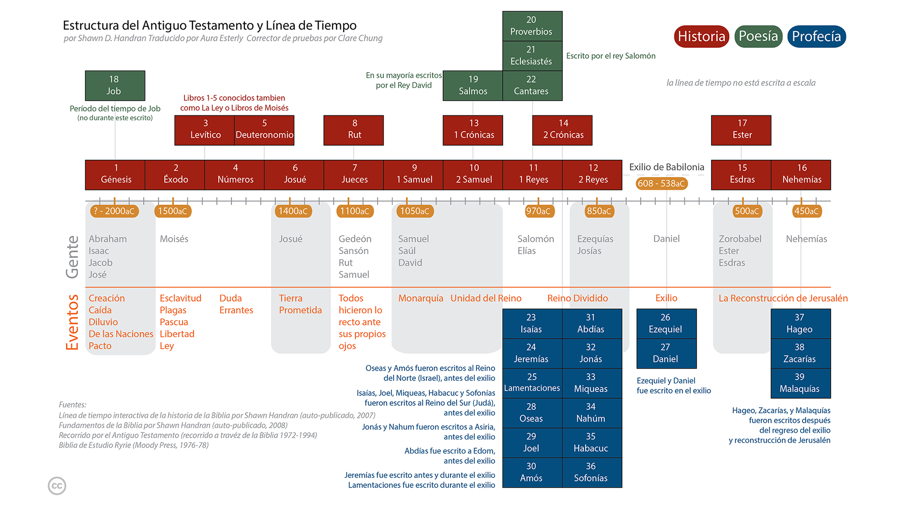

* Bienvenida
* El Enfoque de Lectura No Secuencial
* Comenzando
* La Importancia de la Lectura Diaria
* La Biblia de un Vistazo
* Navegando por la Biblia: Capítulos y Versículos
{:toc}

# Bienvenido
Este curso está diseñado para la persona que quiere aprender lo que significa convertirse o ser un seguidor de Jesús. Muchas personas que buscan este conocimiento se dan cuenta de que la Biblia es donde deben buscar, pero han encontrado obstáculos en su búsqueda por una razón u otra (por ejemplo, intimidados por el tamaño de la Biblia, no saben por dónde empezar, intentaron leer la Biblia pero no pudieron entenderla, se desanimaron, etc.).

Este es un estudio autodirigido para asistirte en tu búsqueda de respuestas. Está diseñado para llevarte rápidamente a través de algunos libros selectos de la Biblia para darte una visión general de lo que significa ser o convertirse en un seguidor de Jesús, y para familiarizarte con la Biblia, que es el manual definitivo para aquellos que desean seguir a Jesús. Para obtener el máximo beneficio, planifica dedicar alrededor de 30 minutos cada día durante las próximas semanas.

El curso consta de dos partes: la primera cubre los conceptos básicos y se puede completar en dos semanas. La segunda parte "profundiza" en la Biblia y requiere cinco semanas adicionales de lectura diaria. Este estudio establece la base fundamental para entender la Biblia y lo que significa ser un seguidor de Jesús.

Al completar este curso, estarás equipado, empoderado y entusiasmado para continuar tu estudio de la Biblia.

# El Enfoque de Lectura No Secuencial
La mayoría de las personas que son nuevas en la Biblia la abordan como cualquier otro libro que leen: comienzan desde el principio y leen linealmente hasta el final.

Sin embargo, esto a menudo lleva a la frustración porque un enfoque de lectura lineal no facilita fácilmente una comprensión de la Biblia *mientras la estás leyendo*. Este curso toma un enfoque diferente al llevarte a través de los libros de la Biblia en un orden no secuencial. De esta manera, se facilita una mayor comprensión del panorama general de la Biblia mientras lo lees; es decir, a medida que avanzas en el calendario de lectura diaria, entenderás cada vez más lo que la Biblia está diciendo.

# Empezando
Necesitarás una Biblia y un lápiz o un resaltador.

No es necesario comprar una versión de estudio de la Biblia para este curso, pero puede ser beneficioso a largo plazo comenzar este curso utilizando una Biblia de estudio. Si el inglés es tu idioma nativo[^1], elige una traducción moderna de la Biblia——NIV, NRSV, NASB, ESV y NKJV son todas excelentes opciones——pero evita las versiones parafraseadas para este estudio. (Las versiones parafraseadas son excelentes para obtener una perspectiva diferente sobre una palabra en el texto original griego o hebreo, pero este tipo de estudio debería reservarse para más adelante en tu camino).

[^1]: En general, entenderás mejor la Biblia en tu primer idioma, así que siéntete libre de usar esa traducción si está disponible en tu lengua materna. Si eres bilingüe, utiliza el idioma con el que te sientas más cómodo.

# La Importancia de la Lectura Diaria
Dedica tiempo cada día para completar las lecturas.

Este curso requiere aproximadamente 20-40 minutos de lectura enfocada y diaria sin interrupciones. Cada día, antes de comenzar a leer, ora a Dios pidiendo que el Espíritu Santo te dé entendimiento y comprensión sobre lo que vas a leer.

Lee la selección de la Biblia tan rápido como puedas sin hacer lectura superficial o rápida (si tienes una Biblia de estudio, no te detengas para leer las notas de comentario, o hazlo solo de forma limitada). Si notas un versículo de interés, márcalo o subráyalo con un lápiz, pero no te detengas a contemplar en este momento todavía (se darán instrucciones al final del curso sobre cómo leer la Biblia de manera contemplativa y cómo usar efectivamente Biblias de estudio y otros comentarios).

Es importante leer todos los días——saltarse uno o dos días hará que sea más difícil recordar dónde te quedaste y también hará que sea más complicado desarrollar una visión de conjunto de la Biblia.

# La Biblia de un Vistazo
La Biblia consta de las Escrituras Hebreas y Griegas.

Las Escrituras hebreas contienen 39 libros escritos por muchos autores diferentes a lo largo de un período de mil años, aproximadamente entre 1400 y 400 a.C. Excepto por algunas secciones, está escrito enteramente en hebreo. Una descripción más detallada de las Escrituras Hebreas se incluye más adelante en este estudio, pero para los propósitos de esta introducción, es suficiente resumir que las Escrituras Hebreas en su conjunto narran una tarea especial y única que el Dios Creador dio a los descendientes de un hombre llamado Abraham: los israelitas. El propósito de esta tarea era que los israelitas fueron "comisionados" para contarle a todas las demás personas del mundo acerca del Dios Creador. Las Escrituras Hebreas contienen muchas referencias sobre la venida de un Mesías (que es la palabra hebrea para salvador o rescatador).

{:.lead width="800" height="100" loading="lazy"}
Estructura y Cronología del Antiguo Testamento
{:.figcaption}

Las Escrituras Griegas contienen 27 libros, también escritos por varios autores diferentes a lo largo de un período de aproximadamente 50 años, alrededor del 40-90 d.C. Las Escrituras Griegas muestran cómo el Dios Creador entró en la historia al convertirse en humano, cumpliendo lo que estaba escrito en las Escrituras Hebreas acerca de la venida del Mesías (Salvador). El Mesías es un descendiente de Abraham llamado Yeshúa (Josué), o como se traduce en inglés: Jesús. La palabra griega para Mesías es Christos, de donde se deriva el título Cristo. Hoy, juntamos el nombre y el título: Jesús (el) Cristo.

{:.lead width="800" height="100" loading="lazy"}
Estructura y Línea de Tiempo del Nuevo Testamento
{:.figcaption}

# Navegando la Biblia: Capítulos y Versículos
La Biblia está numerada para que sea fácil navegar y encontrar un pasaje en particular.

La mayoría de los libros están divididos en capítulos (algunos de los libros más pequeños tienen un único capítulo sin número), y cada capítulo a su vez está dividido en versículos. Un versículo normalmente consiste en una o dos oraciones. Incluso aquellos que no están familiarizados con la Biblia probablemente han escuchado que alguien cita o se refiere a Juan 3:16. Esto significa el libro de Juan, capítulo 3, versículo 16. Cuando busques libros en la Biblia, consulta la tabla de contenidos. En este ejemplo, el libro de Juan, o el Evangelio de Juan como se le conoce por su título más extenso, se encuentra hacia la parte final de la Biblia. Una vez que localices Juan, pasa un par de páginas hasta que llegues al capítulo 3. En la mayoría de las Biblias, el tamaño de letra del número de capítulo es mucho más grande que el resto del texto, mientras que el número de versículo es un pequeño número en superíndice incrustado dentro del mismo texto. Ver ejemplos:

Génesis 1:1	11En el principio, Dios creó los cielos y la tierra.

Juan 3:16	16Porque de tal manera amó Dios al mundo, que ha dado a su Hijo unigénito, para que todo aquel que en él cree no se pierda, mas tenga vida eterna.

[LosFundamentos](LosFundamentos.md){:.heading.flip-title} --- Haz clic aquí para continuar a la siguiente sección.