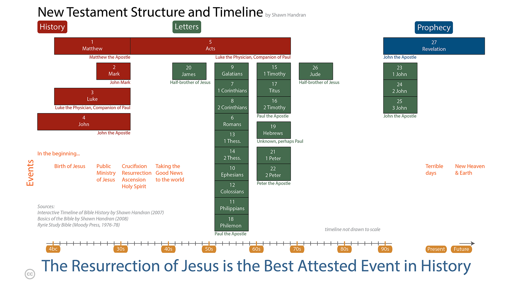

* Welcome
* The Non-Sequential Reading Approach
* Getting Started
* The Importance of Daily Reading
* The Bible at a Glance
* Navigating the Bible: Chapters and Verses 
{:toc}

# Welcome 
This course is designed for the person that wants to learn what it means to become or be a follower of Jesus. Many people that seek this knowledge realize that the Bible is where they must look, but have been hampered in their quest for one reason or another (e.g. intimidated by the size of the Bible, don't know where to begin, tried to read the Bible but couldn't make sense of it, got discouraged, etc.).

This is a self-directed study to assist you in your quest for answers. It is intended to take you rapidly through select books of the Bible to give you a "big picture" overview of what it means to be or become a follower of Jesus, and to become familiarized with the Bible——which is the definitive handbook for those who want to follow Jesus. For maximum benefit, plan on spending about 30 minutes every day for the next few weeks.

The course consists of two parts: the first covers the basics and can be completed in two weeks. The second part "digs deeper" into the Bible and takes an additional five weeks of daily reading. This study lays the basic foundation for understanding the Bible and what it means to be a follower of Jesus.

After completing this course, you will be equipped, empowered and excited to continue your study of the Bible.

# The Non-Sequential Reading Approach
Most people that are new to the Bible approach it like any other book that they read——they start at the beginning and read linearly through to the end. 

However, this often leads to frustration because a linear reading approach does not readily facilitate an understanding of the Bible *as you are reading it*. This course takes a different approach by taking you through books of the Bible in a non-sequential order. As such, this facilitates a greater understanding of the big picture of the Bible as you are reading it——that is, as you progress through the daily reading schedule, you will understand more and more what the Bible is saying.

# Getting Started
You will need a Bible and a pencil or highlighter.

It is not necessary to buy a study version of the Bible for this course, but you may find it beneficial in the long term to start this course using a study Bible. If English is your native language[^1], choose a modern Bible translation——NIV, NRSV, NASB, ESV and NKJV are all excellent choices——but avoid paraphrase versions for this study. (Paraphrase versions are excellent for getting a different perspective on a word in the original Greek or Hebrew text, but this type of study should be saved for later in your journey.)

[^1]: Generally, you'll understand the Bible best in your first language, so feel free to use that translation if it is available in your native tongue. If you are bilingual, use the language with which you are most comfortable

# The Importance of Daily Reading
Carve out time each day to complete the readings.

This course requires about 20-40 minutes of focused, uninterrupted daily reading. Every day before you begin reading, pray to God asking that the Holy Spirit would give you insight and understanding into what you are about to read.

Read the Bible selection as quickly as you can without skimming or speed reading (if you have a study Bible, do not stop to read the commentary notes, or do so only sparingly). If you notice a verse of interest, highlight it or underline it with a pencil, but do not stop to contemplate at this point in time yet (instructions will be given at the end of the course on how to read the Bible contemplatively and how to effectively use study Bibles and other commentaries).

It is important to read every day——missing a day or two will make it more difficult to remember where you left off and will also make it harder for you to develop a "big picture" view of the Bible.

# The Bible at a Glance
The Bible consists of the Hebrew and Greek Scriptures.

The Hebrew Scriptures contain 39 books written by many different authors over a one thousand year period, between approximately 1400-400 BC. Except for a few sections, it is written entirely in Hebrew. A more detailed description of the Hebrew Scriptures is included later in this study, but for the purposes of this introduction, it is sufficient to summarize that the Hebrew Scriptures as a whole tell of a special and unique task that the Creator God gave to the descendants of a man named Abraham——the Israelites. The purpose of this task was that the Israelites were "commissioned" to tell all the other people of the world about the Creator God. The Hebrew Scriptures contain many references of the coming of a Messiah (which is the Hebrew word for savior or rescuer).

{:.lead width="800" height="100" loading="lazy"}
Old Testament Structure and Timeline
{:.figcaption}

The Greek Scriptures contain 27 books, also written by several different authors over a period of approximately 50 years, around 40-90 AD. The Greek Scriptures show how the Creator God entered into history by becoming a human, fulfilling what was written in the Hebrew Scriptures about the coming Messiah (Savior). The Messiah is a descendant of Abraham named Yeshua (Joshua), or as translated in English: Jesus. The Greek word for Messiah is Christos, from which the title Christ is derived. Today, we put the name and title together: Jesus (the) Christ.

{:.lead width="800" height="100" loading="lazy"}
New Testament Structure and Timeline
{:.figcaption}

# Navigating the Bible: Chapters and Verses
The Bible is numbered so that it is easy to navigate and find a particular passage.

Most of the books are divided into chapters (a few of the smallest books have a single un-numbered chapter), and each chapter in turn is divided into verses. A verse is typically one or two sentences. Even those that are unfamiliar with the Bible have probably heard someone quote or refer to John 3:16. This means the book of John, chapter 3, verse 16. When looking up books in the Bible, refer to the table of contents. In this example, the book of John, or the Gospel of John as it is known by its longer title, is located toward the back of the Bible. Once you locate John, flip through a couple of pages until you reach chapter 3. In most Bibles, the font size of the chapter number is much larger than the rest of the text whereas the verse number is a small superscript number embedded within the text itself. See examples:

Genesis 1:1	11In the beginning God created the heavens and the earth.  

John 3:16	16For God so loved the world that he gave his one and only Son, that whoever believes in him shall not perish but have eternal life.

[TheBasics](TheBasics.md){:.heading.flip-title} --- Click here to continue to the next section.