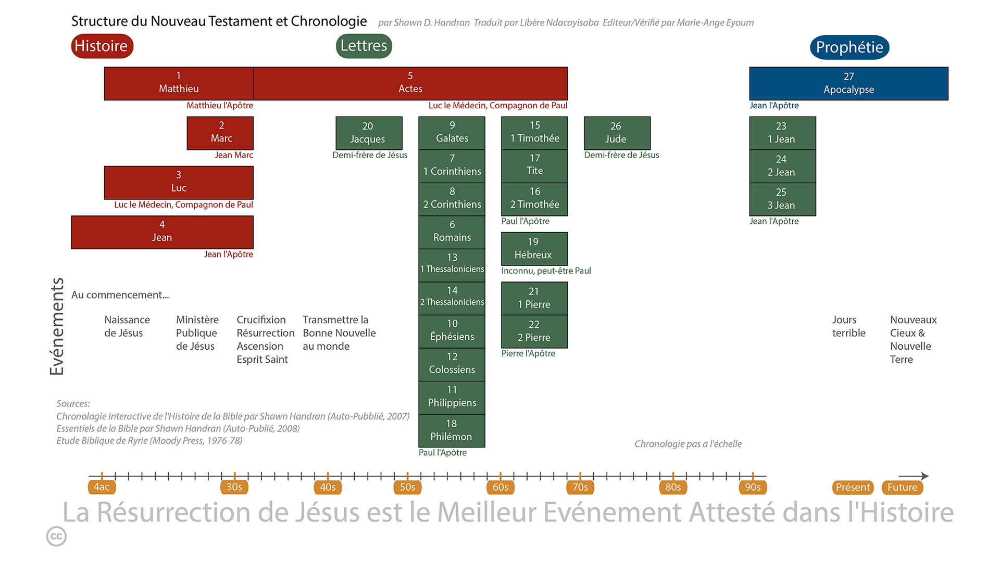

* Bienvenue
* L'approche de lecture non séquentielle
* Commencer
* L'importance de la lecture quotidienne
* La Bible en un coup d'œil
* Naviguer dans la Bible : chapitres et versets 
{:toc}

# Bienvenue
Ce cours est conçu pour la personne qui souhaite apprendre ce que cela signifie devenir ou être un disciple de Jésus. Beaucoup de personnes qui recherchent cette connaissance réalisent que la Bible est l'endroit où elles doivent chercher, mais ont été freiné dans leur quête pour une raison ou une autre (par exemple, intimidés par la taille de la Bible, ne savent pas par où commencer, ont essayé de lire la Bible mais n'ont pas pu la comprendre, se sont découragés, etc.).

Ceci est une étude autodirigée pour vous aider dans votre quête de réponses. Elle est conçue pour vous faire parcourir rapidement certains livres de la Bible afin de vous donner une vue d'ensemble "globale" de ce que signifie être ou devenir un disciple de Jésus, et de vous familiariser avec la Bible, qui est le guide de référence pour ceux qui veulent suivre Jésus. Pour en tirer le maximum de bénéfices, prévoyez de passer environ 30 minutes chaque jour au cours des prochaines semaines.

Le cours se compose de deux parties : la première couvre les bases et peut être complétée en deux semaines. La deuxième partie "creuse plus profondément" dans la Bible et nécessite cinq semaines supplémentaires de lecture quotidienne. Cette étude établit la base fondamentale pour comprendre la Bible et ce que cela signifie être un disciple de Jésus.

Après avoir terminé ce cours, vous serez équipé, habilité et enthousiaste à poursuivre votre étude de la Bible.

# L'Approche de Lecture Non Séquentielle
La plupart des personnes qui découvrent la Bible l'abordent comme n'importe quel autre livre qu'elles lisent——elles commencent par le début et lisent linéairement jusqu'à la fin.

Cependant, cela conduit souvent à la frustration car une approche de lecture linéaire ne facilite pas vraiment la compréhension de la Bible *au fur et à mesure que vous la lisez*. Ce cours adopte une approche différente en vous faisant parcourir les livres de la Bible dans un ordre non séquentiel. Ainsi, cela facilite une meilleure compréhension de l'ensemble de la Bible au fur et à mesure que vous la lisez. En d'autres termes, à mesure que vous avancez dans le programme de lecture quotidien, vous comprenez de plus en plus ce que la Bible dit.

# Commencer
Vous aurez besoin d'une Bible et d'un crayon ou d'un surligneur.

Il n'est pas nécessaire d'acheter une version d'étude de la Bible pour ce cours, mais vous pourriez trouver avantageux à long terme de commencer ce cours avec une Bible d'étude. Si l'anglais est votre langue maternelle[^1], choisissez une traduction moderne de la Bible——NIV, NRSV, NASB, ESV et NKJV sont tous d'excellents choix——mais évitez les versions paraphrasées pour cette étude. (Les versions paraphrasées sont excellentes pour obtenir une perspective différente sur un mot dans le texte original en grec ou en hébreu, mais ce type d'étude devrait être réservé pour plus tard dans votre parcours.)

[^1] : En général, vous comprendrez mieux la Bible dans votre langue maternelle, alors n'hésitez pas à utiliser cette traduction si elle est disponible dans votre langue native. Si vous êtes bilingue, utilisez la langue avec laquelle vous êtes le plus à l'aise.

# L'Importance de la Lecture Quotidienne
Prenez le temps chaque jour pour terminer les lectures.

Ce cours nécessite environ 20 à 40 minutes de lecture quotidienne concentrée et ininterrompue. Chaque jour, avant de commencer à lire, priez Dieu en lui demandant que le Saint-Esprit vous donne une perception et une compréhension de ce que vous allez lire.

Lisez la sélection de la Bible aussi rapidement que possible sans sauter des passages ni utiliser la lecture rapide (si vous avez une Bible d'étude, ne vous arrêtez pas pour lire les notes de commentaire, ou faites-le seulement de manière parcimonieuse). Si vous remarquez un verset qui vous intéresse, mettez-le en surbrillance ou soulignez-le avec un crayon, mais ne vous arrêtez pas pour méditer à ce stade (des instructions vous seront données à la fin du cours sur la manière de lire la Bible de manière contemplative et d'utiliser efficacement les Bibles d'étude et d'autres commentaires).

Il est important de lire chaque jour——manquer un jour ou deux rendra plus difficile de se souvenir d'où vous vous êtes arrêté et rendra également plus difficile pour vous de développer une vue d'ensemble de la Bible.

# La Bible en un coup d'œil
La Bible se compose des Écritures hébraïques et grecques.

Les Écritures hébraïques contiennent 39 livres écrits par de nombreux auteurs différents sur une période de mille ans, entre environ 1400 et 400 avant J.-C. À l'exception de quelques sections, elles sont entièrement rédigées en hébreu. Une description plus détaillée des Écritures hébraïques est incluse plus loin dans cette étude, mais pour les besoins de cette introduction, il suffit de résumer que les Écritures hébraïques, dans leur ensemble, racontent une mission spéciale et unique que le Dieu Créateur a confiée aux descendants d'un homme nommé Abraham——les Israélites. Le but de cette mission était que les Israélites étaient "chargés" de parler du Dieu Créateur à tous les autres peuples du monde. Les Écritures hébraïques contiennent de nombreuses références à la venue d'un Messie (qui est le mot hébreu pour sauveur ou libérateur).

{:.lead width="800" height="100" loading="lazy"}
Structure et chronologie de l'Ancien Testament
{:.figcaption}

Les Écritures grecques contiennent 27 livres, également écrits par plusieurs auteurs différents sur une période d'environ 50 ans, autour de 40-90 après J.-C. Les Écritures grecques montrent comment le Dieu Créateur est entré dans l'histoire en devenant un être humain, accomplissant ce qui était écrit dans les Écritures hébraïques au sujet du Messie (Sauveur) à venir. Le Messie est un descendant d'Abraham nommé Yeshua (Josué), ou, traduit en anglais : Jésus. Le mot grec pour Messie est Christos, d'où dérive le titre Christ. Aujourd'hui, nous assemblons le nom et le titre : Jésus (le) Christ.

{:.lead width="800" height="100" loading="lazy"}
Structure et Chronologie du Nouveau Testament
{:.figcaption}

# Naviguer dans la Bible : Chapitres et Versets
La Bible est numérotée afin qu'il soit facile de l'explorer et de retrouver un passage particulier.

La plupart des livres sont divisés en chapitres (quelques-uns des plus petits livres ont un seul chapitre non numéroté), et chaque chapitre est à son tour divisé en versets. Un verset est généralement constitué d'une ou deux phrases. Même ceux qui ne sont pas familiers avec la Bible ont probablement entendu quelqu'un citer ou se référer à Jean 3:16. Cela signifie le livre de Jean, chapitre 3, verset 16. Pour trouver les livres de la Bible, référez-vous à la table des matières. Dans cet exemple, le livre de Jean, ou l'Évangile selon Jean comme on l'appelle par son titre complet, se trouve vers la fin de la Bible. Une fois que vous avez localisé Jean, feuilletez quelques pages jusqu'à atteindre le chapitre 3. Dans la plupart des Bibles, la taille de la police du numéro de chapitre est beaucoup plus grande que celle du reste du texte alors que le numéro du verset est un petit chiffre en exposant intégré dans le texte lui-même. Voir des exemples :

Genèse 1:1 11Au commencement, Dieu créa les cieux et la terre.

Jean 3:16	16Car Dieu a tant aimé le monde qu'il a donné son Fils unique, afin que quiconque croit en lui ne périsse point, mais qu'il ait la vie éternelle.

[LesBases](LesBases.md){:.heading.flip-title} --- Cliquez ici pour continuer à la section suivante.