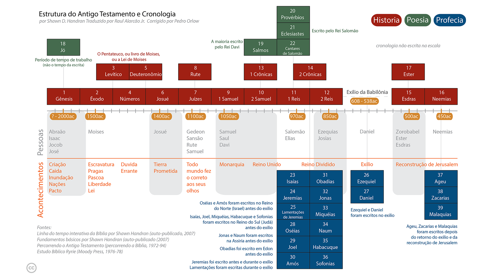
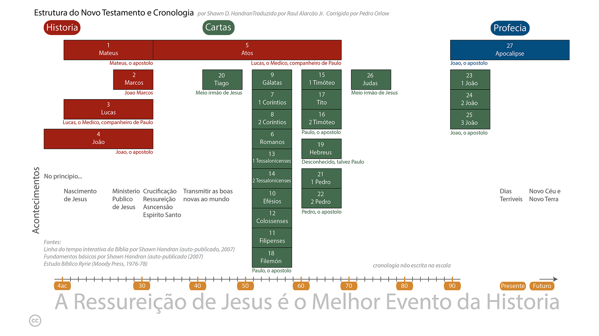

* Bem-vindo
* A Abordagem de Leitura Não Sequencial
* Como Começar
* A Importância da Leitura Diária
* A Bíblia em Resumo
* Navegando na Bíblia: Capítulos e Versículos 
{:toc}

# Bem-vindo
Este curso é projetado para a pessoa que deseja aprender o que significa tornar-se ou ser um seguidor de Jesus. Muitas pessoas que buscam esse conhecimento percebem que a Bíblia é onde devem procurar, mas foram impedidas em sua busca por uma razão ou outra (por exemplo, intimidadas pelo tamanho da Bíblia, não sabem por onde começar, tentaram ler a Bíblia, mas não conseguiram entendê-la, desanimaram, etc.).

Este é um estudo autodirigido para auxiliar você em sua busca por respostas. Tem a finalidade de conduzi-lo rapidamente por livros selecionados da Bíblia para lhe dar uma visão geral "abrangente" do que significa ser ou tornar-se um seguidor de Jesus, e para se familiarizar com a Bíblia — que é o manual definitivo para aqueles que desejam seguir Jesus. Para obter o máximo benefício, planeje dedicar cerca de 30 minutos todos os dias pelas próximas semanas.

O curso consiste em duas partes: a primeira cobre os fundamentos básicos e pode ser concluída em duas semanas. A segunda parte "aprofundada" na Bíblia exige cinco semanas adicionais de leitura diária. Este estudo estabelece a base fundamental para compreender a Bíblia e o que significa ser um seguidor de Jesus.

Após concluir este curso, você estará equipado, capacitado e animado para continuar seu estudo da Bíblia.

# A Abordagem de Leitura Não Sequencial
A maioria das pessoas que são novas na Bíblia a aborda como qualquer outro livro que leem —— começam no início e leem linearmente até o fim.

No entanto, isso muitas vezes leva à frustração porque uma abordagem de leitura linear não facilita prontamente o entendimento da Bíblia *enquanto você a está lendo*. Este curso adota uma abordagem diferente, levando você através dos livros da Bíblia em uma ordem não sequencial. Como tal, isso facilita um maior entendimento do panorama geral da Bíblia à medida que você está lendo——isto é, à medida que você avança no cronograma de leitura diária, você entenderá cada vez mais o que a Bíblia está dizendo.

# Começando
Você precisará de uma Bíblia e de um lápis ou de um marcador de texto.

Não é necessário comprar uma versão de estudo da Bíblia para este curso, mas você pode achar benéfico a longo prazo começar este curso usando uma Bíblia de estudo. Se o inglês é sua língua nativa[^1], escolha uma tradução moderna da Bíblia——NIV, NRSV, NASB, ESV e NKJV são todas excelentes escolhas——mas evite versões parafraseadas para este estudo. (As versões parafraseadas são excelentes para obter uma perspectiva diferente sobre uma palavra no texto original em grego ou hebraico, mas esse tipo de estudo deve ser guardado para mais adiante em sua jornada.)

[^1]: Geralmente, você entenderá a Bíblia melhor em sua língua materna, então sinta-se à vontade para usar essa tradução, se estiver disponível no seu idioma nativo. Se você é bilíngue, use o idioma com o qual se sente mais confortável.

# A Importância da Leitura Diária
Reserve tempo todos os dias para completar as leituras.

Este curso requer cerca de 20-40 minutos de leitura focada e ininterrupta diariamente. Todos os dias, antes de começar a leitura, ore a Deus pedindo que o Espírito Santo lhe dê discernimento e compreensão sobre o que você está prestes a ler.

Leia a seleção da Bíblia o mais rápido que puder sem escanear ou ler rapidamente (se você tiver uma Bíblia de estudo, não pare para ler as notas do comentário, ou faça isso apenas esporadicamente). Se você notar um versículo de interesse, destaque-o ou sublinhe-o com um lápis, mas não pare para contemplar neste momento (instruções serão dadas ao final do curso sobre como ler a Bíblia contemplativamente e como usar efetivamente Bíblias de estudo e outros comentários).

É importante ler todos os dias——pular um dia ou dois tornará mais difícil lembrar onde você parou e também dificultará o desenvolvimento de uma visão "panorâmica" da Bíblia.

# A Bíblia em Resumo
A Bíblia é composta pelas Escrituras Hebraicas e Grega.

As Escrituras Hebraicas contêm 39 livros escritos por muitos autores diferentes ao longo de um período de mil anos, entre aproximadamente 1400-400 a.C. Com exceção de algumas seções, está inteiramente escrito em hebraico. Uma descrição mais detalhada das Escrituras Hebraicas é incluída mais adiante neste estudo, mas para os propósitos desta introdução, é suficiente resumir que as Escrituras Hebraicas como um todo contam a tarefa especial e única que o Deus Criador deu aos descendentes de um homem chamado Abraão——os israelitas. O propósito dessa tarefa era que os israelitas fossem "comissionados" para contar a todas as outras pessoas do mundo sobre o Deus Criador. As Escrituras Hebraicas contêm muitas referências à vinda de um Messias (que é a palavra hebraica para salvador ou resgatador).

{:.lead width="800" height="100" loading="lazy"}
Estrutura e Cronologia do Antigo Testamento
{:.figcaption}

As Escrituras Gregas contêm 27 livros, também escritos por vários autores diferentes ao longo de um período de aproximadamente 50 anos, por volta de 40-90 d.C. As Escrituras Gregas mostram como o Deus Criador entrou na história tornando-se humano, cumprindo o que foi escrito nas Escrituras Hebraicas sobre a vinda do Messias (Salvador). O Messias é um descendente de Abraão chamado Yeshua (Josué), ou como traduzido em português: Jesus. A palavra grega para Messias é Christos, de onde é derivado o título Cristo. Hoje, juntamos o nome e o título: Jesus (o) Cristo.

{:.lead width="800" height="100" loading="lazy"}
Estrutura e Linha do Tempo do Novo Testamento
{:.figcaption}

# Navegando na Bíblia: Capítulos e Versículos
A Bíblia é numerada para que seja fácil navegar e encontrar uma passagem específica.

A maioria dos livros está dividida em capítulos (alguns dos menores livros têm um único capítulo sem numeração), e cada capítulo, por sua vez, é dividido em versículos. Um versículo é tipicamente uma ou duas sentenças. Mesmo aqueles que não estão familiarizados com a Bíblia provavelmente já ouviram alguém citar ou referir-se a João 3:16. Isso significa o livro de João, capítulo 3, versículo 16. Ao procurar livros na Bíblia, consulte o índice. Neste exemplo, o livro de João, ou o Evangelho de João como é conhecido pelo seu título completo, está localizado mais para o final da Bíblia. Assim que encontrar João, folheie algumas páginas até alcançar o capítulo 3. Na maioria das Bíblias, o tamanho da fonte do número do capítulo é muito maior do que o resto do texto, enquanto o número do versículo é um pequeno número sobrescrito embutido no próprio texto. Veja exemplos:

Gênesis 1:1	11No princípio, Deus criou os céus e a terra.

João 3:16 16Porque Deus amou tanto o mundo que deu o seu Filho unigênito, para que todo aquele que nele crê não pereça, mas tenha a vida eterna.

[OBasico](OBasico.md){:.heading.flip-title} --- Clique aqui para continuar para a próxima seção.