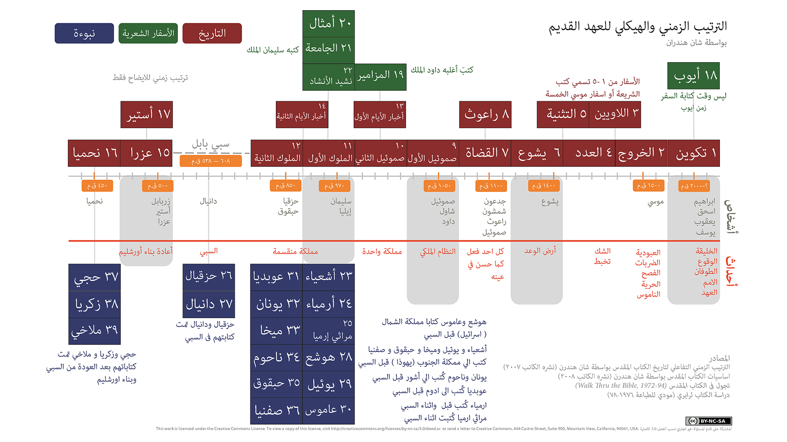

* مرحبًا بكم
* نهج القراءة غير التتابعي
* كيفية البدء
* أهمية القراءة اليومية
* لمحة سريعة عن الكتاب المقدس
* التنقل في الكتاب المقدس: الفصول والآيات 
{:toc}

# مرحباً
تم تصميم هذه الدورة للشخص الذي يريد أن يتعلم ما يعنيه أن يصبح أو يكون تابعاً ليسوع. يدرك العديد من الأشخاص الذين يسعون إلى هذا المعرفة أن الكتاب المقدس هو المكان الذي يجب أن ينظروا إليه، لكنهم أصيبوا بالإحباط في رحلتهم لأسباب متنوعة (مثل الشعور بالخوف من حجم الكتاب المقدس، لا يعرفون من أين يبدؤون، حاولوا قراءة الكتاب المقدس ولكن لم يتمكنوا من فهمه، شعروا بالإحباط، إلخ).

هذه دراسة ذاتية التوجيه لمساعدتك في سعيك للحصول على إجابات. تهدف إلى أخذك بسرعة عبر كتب مختارة من الكتاب المقدس لتقديم نظرة عامة "شاملة" لما يعنيه أن تكون أو تصبح تابعًا ليسوع، ولتعريفك بالكتاب المقدس——الذي هو الدليل الحاسم لأولئك الذين يرغبون في اتباع يسوع. لتحقيق أقصى استفادة، خطط لقضاء حوالي 30 دقيقة كل يوم خلال الأسابيع القليلة القادمة.

يتكون الدورة من جزئين: يغطي الجزء الأول الأساسيات ويمكن إكماله في غضون أسبوعين. أما الجزء الثاني فيغوص بعمق أكبر في الكتاب المقدس ويستغرق خمسة أسابيع إضافية من القراءة اليومية. تهدف هذه الدراسة إلى وضع الأساس الأساسي لفهم الكتاب المقدس وما يعنيه أن تكون تابعًا ليسوع.

بعد إكمال هذا الدورة، ستكون مجهزًا، وممكّنًا، ومتحمسًا لمواصلة دراستك في الكتاب المقدس.

# نهج القراءة غير المتسلسل

غالبية الأشخاص الجدد في دراسة الكتاب المقدس يتناولونه كما يتعاملون مع أي كتاب آخر يقرؤونه - يبدأون من البداية ويقرأون خطيًا حتى النهاية.

ومع ذلك، غالبًا ما يؤدي هذا إلى الإحباط لأن النهج القائم على القراءة الخطية لا يسهل فهم الكتاب المقدس *أثناء قراءتك له*. يتبع هذا الدرس نهجًا مختلفًا من خلال أخذكم عبر كتب الكتاب المقدس بطريقة غير تسلسلية. وبالتالي، يسهل ذلك فهمًا أكبر للصورة الكبيرة للكتاب المقدس أثناء قراءتك له —— أي أنه بينما تتقدم في جدول القراءة اليومي، ستفهم بشكل متزايد ما يقوله الكتاب المقدس.

# البدء
سوف تحتاج إلى كتاب مقدس و قلم رصاص أو قلم تعليم.

ليس من الضروري شراء نسخة دراسة من الكتاب المقدس لهذه الدورة، ولكن قد تجد أنه من المفيد على المدى الطويل أن تبدأ هذه الدورة باستخدام كتاب مقدس دراسة. إذا كانت الإنجليزية هي لغتك الأم[^1]، اختر ترجمة حديثة للكتاب المقدس مثل NIV، NRSV، NASB، ESV وNKJV، فجميعها اختيارات ممتازة، ولكن تجنّب النسخ التفسيرية لهذه الدراسة. (النسخ التفسيرية ممتازة للحصول على منظور مختلف لكلمة في النصوص اليونانية أو العبرية الأصلية، لكن ينبغي حفظ هذا النوع من الدراسة في مرحلة لاحقة من رحلتك.)

[^1]: بشكل عام، ستفهم الكتاب المقدس بشكل أفضل بلغتك الأم، لذا لا تتردد في استخدام تلك الترجمة إذا كانت متوفرة بلغتك الأصلية. إذا كنت تتحدث لغتين، فاستخدم اللغة التي تشعر براحة أكبر معها.

# أهمية القراءة اليومية
خصص وقتًا كل يوم لإتمام القراءات.

تتطلب هذه الدورة حوالي 20-40 دقيقة من القراءة اليومية المركزة دون انقطاع. كل يوم قبل أن تبدأ القراءة، صلِّ إلى الله طالبًا من الروح القدس أن يمنحك الفهم والإدراك لما أنت على وشك قراءته.

اقرأ مقتطف الكتاب المقدس بأسرع ما يمكنك بدون القراءة السريعة أو التجاوز (إذا كان لديك كتاب دراسة للكتاب المقدس، لا تتوقف لقراءة الملاحظات التفسيرية، أو قم بذلك بحذر فقط). إذا لاحظت آية مثيرة للاهتمام، قم بتظليلها أو وضع خط تحتها بقلم رصاص، ولكن لا تتوقف للتأمل في هذه اللحظة (ستُعطى التعليمات في نهاية الدورة حول كيفية قراءة الكتاب المقدس بشكل تأملي وكيفية استخدام كتب الدراسة والتفاسير الأخرى بفاعلية).

من المهم أن تقرأ كل يوم——ففقدان يوم أو يومين سيجعل من الصعب تذكر أين توقفت وسيجعل من الأصعب عليك تطوير رؤية "الصورة الكبيرة" للكتاب المقدس.

# لمحة عن الكتاب المقدس
يتكون الكتاب المقدس من الأسفار العبرية واليونانية.

تحتوي الكتب العبرية على 39 كتابًا كتبها العديد من المؤلفين المختلفين على مدى ألف عام، بين حوالي 1400-400 قبل الميلاد. باستثناء بعض الأقسام، كُتبت هذه الكتب بالكامل باللغة العبرية. سيتم تضمين وصف أكثر تفصيلًا للكتب العبرية لاحقًا في هذه الدراسة، ولكن لأغراض هذه المقدمة، يكفي تلخيص أن الكتب العبرية ككل تحكي عن مهمة خاصة وفريدة أعطاها الله الخالق لذرية رجل اسمه إبراهيم وهم الإسرائيليون. وكان هدف هذه المهمة أن يُكلف الإسرائيليون بإخبار جميع الناس الآخرين في العالم عن الله الخالق. تحتوي الكتب العبرية على العديد من الإشارات إلى قدوم مسيح (وهي الكلمة العبرية للمخلص أو المنقذ).

{:.lead width="800" height="100" loading="lazy"}
هيكل العهد القديم وجدول زمني
{:.figcaption}

تحتوي الكتابات اليونانية على 27 كتابًا، كُتبت أيضًا بواسطة عدة مؤلفين مختلفين على مدار فترة تقارب 50 عامًا، تقريبًا بين سنة 40 و90 بعد الميلاد. تُظهر الكتابات اليونانية كيف دخل الله الخالق إلى التاريخ بأن صار إنسانًا، متممًا ما كُتب في الكتابات العبرية عن مجيء المسيح (المخلص). المسيح هو أحد أحفاد إبراهيم واسمه يشوع (يوشع)، أو كما يُترجم في الإنجليزية: يسوع. الكلمة اليونانية للمسيح هي كريستوس، التي اشتُق منها اللقب المسيح. واليوم، نضع الاسم واللقب معًا: يسوع (الـ)مسيح.

{:.lead width="800" height="100" loading="lazy"}
هيكل وجدول زمني للعهد الجديد
{:.figcaption}

# التنقل في الكتاب المقدس: الإصحاحات والآيات
يُرقم الكتاب المقدس بشكل يجعل من السهل التنقل والبحث عن مقطع معين.

معظم الكتب مقسمة إلى فصول (القليل من الكتب الصغيرة تحتوي على فصل واحد غير مرقم) وكل فصل مقسّم بدوره إلى آيات. عادةً ما تكون الآية جملة أو جملتين. حتى أولئك الذين ليسوا على دراية بالكتاب المقدس ربما سمعوا شخصًا يقتبس أو يشير إلى يوحنا 3:16. هذا يعني إنجيل يوحنا، الفصل 3، الآية 16. عند البحث عن الكتب في الكتاب المقدس، يُرجى الرجوع إلى الفهرس. في هذا المثال، يقع كتاب إنجيل يوحنا أو إنجيل يوحنا كما يعرف بعنوانه الأطول، في النهاية الخلفية للكتاب المقدس. بمجرد تحديد موقع يوحنا، تقليب بضع صفحات حتى تصل إلى الفصل 3. في معظم النسخ من الكتب المقدسة، يكون حجم الخط لرقم الفصل أكبر بكثير من بقية النص، في حين أن رقم الآية هو رقم صغير مرفوع مضمّن داخل النص نفسه. انظر الأمثلة:

تكوين 1:1 11 في البدء خلق الله السماوات والأرض.

يوحنا 3:16 16لأن الله أحب العالم حتى بذل ابنه الوحيد لكي لا يهلك كل من يؤمن به، بل تكون له الحياة الأبدية.

[الأساسيات](الأساسيات.md){:.heading.flip-title} --- انقر هنا للمتابعة إلى القسم التالي.