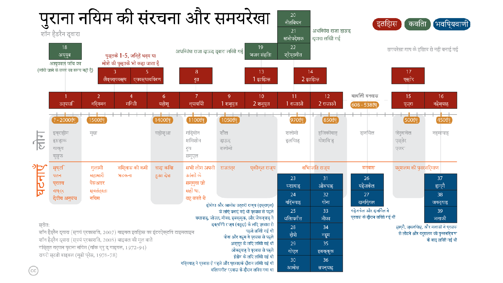
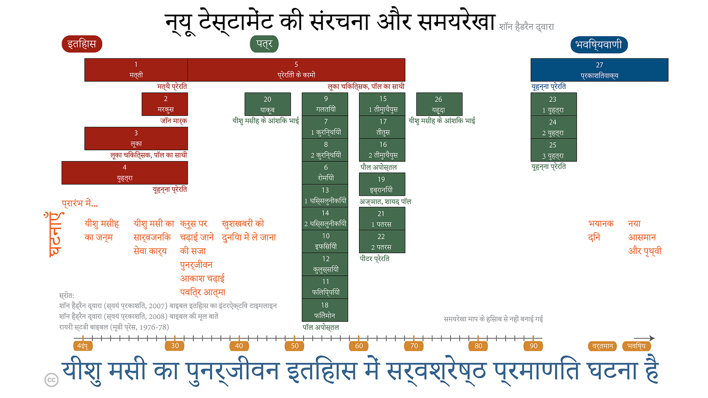

* स्वागत है 
* गैर-अनुक्रमिक पठन दृष्टिकोण 
* प्रारंभ करना 
* दैनिक पठन का महत्व 
* एक नज़र में बाइबल 
* बाइबल को नेविगेट करना: अध्याय और छंद 
{:toc}

# स्वागत है 
यह पाठ्यक्रम उस व्यक्ति के लिए डिज़ाइन किया गया है जो यह जानना चाहता है कि यीशु का अनुयायी बनने या होने का क्या अर्थ है। कई लोग जो इस ज्ञान की तलाश करते हैं, यह महसूस करते हैं कि बाइबल वह स्थान है जहाँ उन्हें देखना चाहिए, लेकिन किसी न किसी कारण से उनकी खोज बाधित हो गई है (जैसे बाइबल के आकार से भयभीत, यह नहीं जानते कि कहां से शुरू करें, बाइबल पढ़ने की कोशिश की लेकिन समझ में नहीं आया, निराश हो गए, आदि)।

यह एक आत्म-निर्देशित अध्ययन है जो आपके उत्तर प्राप्त करने के प्रयास में आपकी सहायता करेगा। इसका उद्देश्य आपको बाइबल की कुछ चुनी हुई किताबों के माध्यम से तेजी से ले जाना है ताकि आपको एक "समग्र दृष्टिकोण" दिया जा सके कि यीशु का अनुयायी होना या बनना क्या मायने रखता है, और बाइबल से परिचित कराना—जो कि उन लोगों के लिए निर्णायक पुस्तक है जो यीशु का अनुसरण करना चाहते हैं। अधिकतम लाभ के लिए, अगले कुछ हफ्तों के लिए हर दिन लगभग 30 मिनट लगाने की योजना बनाएं।

पाठ्यक्रम में दो भाग होते हैं: पहला भाग मूलभूत बातें कवर करता है और इसे दो सप्ताह में पूरा किया जा सकता है। दूसरा भाग बाइबल में "गहराई से अन्वेषण" करता है और इसमें प्रतिदिन पढ़ाई के लिए अतिरिक्त पाँच सप्ताह का समय लगता है। यह अध्ययन बाइबल को समझने और यीशु के अनुयायी होने का क्या अर्थ है, इसकी बुनियादी नींव तैयार करता है।

इस पाठ्यक्रम को पूरा करने के बाद, आप बाइबल के अध्ययन को जारी रखने के लिए सुसज्जित, सशक्त और उत्साहित होंगे।

# गैर-अनुक्रमिक पठन दृष्टिकोण
अधिकांश लोग जो बाइबल के लिए नए होते हैं, इसे किसी अन्य पुस्तक की तरह ही पढ़ते हैं——वे शुरुआत में शुरू करते हैं और अंत तक रैखिक रूप से पढ़ते हैं।

हालांकि, यह अक्सर निराशा का कारण बनता है क्योंकि एक रैखिक पठन दृष्टिकोण बाइबल की समझ को *उस समय* पढ़ते हुए सहजता से नहीं प्रदान करता है। यह पाठ्यक्रम एक भिन्न दृष्टिकोण अपनाता है, जो आपको बाइबल की पुस्तकों के माध्यम से गैर-अनुक्रमिक क्रम में ले जाता है। इस प्रकार, यह बाइबल की कुल दृष्टिकोण की गहरी समझ का संवर्धन करता है जब आप इसे पढ़ रहे होते हैं——यानी, जैसे-जैसे आप दैनिक पठन कार्यक्रम का अनुसरण करते जाते हैं, आप और अधिक समझते जाते हैं कि बाइबल क्या कह रही है।

# शुरुआत कर रहे हैं
आपको एक बाइबल और एक पेंसिल या हाइलाइटर की आवश्यकता होगी।

इस कोर्स के लिए बाइबिल के अध्ययन संस्करण को खरीदना आवश्यक नहीं है, लेकिन आपको यह दीर्घकाल में लाभकारी लग सकता है यदि आप इस कोर्स को एक अध्ययन बाइबिल का उपयोग करके शुरू करें। यदि अंग्रेज़ी आपकी मातृ भाषा है[^1], तो एक आधुनिक बाइबिल अनुवाद चुनें——NIV, NRSV, NASB, ESV और NKJV सभी उत्कृष्ट विकल्प हैं——लेकिन इस अध्ययन के लिए पैराफ्रेज़ संस्करणों से बचें। (पैराफ्रेज़ संस्करण मूल यूनानी या हिब्रू पाठ में किसी शब्द पर एक अलग दृष्टिकोण प्राप्त करने के लिए उत्कृष्ट हैं, लेकिन इस प्रकार के अध्ययन को आपकी यात्रा के बाद के चरणों के लिए सुरक्षित रखा जाना चाहिए।)

[^1]: आमतौर पर, आप बाइबल को अपनी पहली भाषा में सबसे अच्छे से समझेंगे, इसलिए अगर यह अनुवाद आपकी मातृभाषा में उपलब्ध है तो इसका उपयोग करने में संकोच न करें। यदि आप द्विभाषी हैं, तो उस भाषा का उपयोग करें जिसमें आप सबसे अधिक सहज हैं।

# दैनिक पठन का महत्व  
प्रतिदिन के पठन को पूरा करने के लिए प्रत्येक दिन समय निकालें।

इस पाठ्यक्रम के लिए ध्यान केंद्रित करने के लिए 20-40 मिनट और बिना रुकावट के दैनिक पढ़ाई की आवश्यकता होती है। हर दिन पढ़ाई शुरू करने से पहले, परमेश्वर से प्रार्थना करें कि पवित्र आत्मा आपको जो पढ़ने जा रहे हैं उसमें अंतर्दृष्टि और समझ प्रदान करे।

बाइबल चयन को जितनी जल्दी आप कर सकते हैं उतनी जल्दी पढ़ें, बिना ऊपर-ऊपर पढ़े या तेजी से पढ़ने के (यदि आपके पास एक अध्ययन बाइबल है, तो टीका टिप्पणियों को पढ़ने के लिए न रुकें, या ऐसा केवल कुछ ही करें)। यदि आप किसी रोचक पद को नोटिस करते हैं, तो उसे हाइलाइट या पेंसिल से रेखांकित कर दें, लेकिन इस समय पर गहराई में विचार करने के लिए न रुकें (बाइबल को ध्यानपूर्वक कैसे पढ़ा जाए और अध्ययन बाइबल्स और अन्य टीकाओं का प्रभावी उपयोग कैसे किया जाए, इस पाठ्यक्रम के अंत में निर्देश दिए जाएंगे)।

यह हर दिन पढ़ना महत्वपूर्ण है——एक या दो दिन छोड़ना यह याद रखना और अधिक कठिन बना देगा कि आप कहाँ छोड़े थे और यह भी आपके लिए बाइबल का "बड़ा चित्र" दृष्टिकोण विकसित करना कठिन बना देगा।

# एक नजर में बाइबल
बाइबल हेब्रू और ग्रीक धर्मग्रंथों से मिलकर बनी है।

हिब्रू शास्त्रों में 39 पुस्तकें शामिल हैं, जो कई अलग-अलग लेखकों द्वारा लगभग 1400-400 ई.पू. के बीच, एक हजार वर्ष की अवधि में लिखी गई हैं। कुछ खंडों को छोड़कर, यह पूरी तरह से हिब्रू में लिखा गया है। हिब्रू शास्त्रों का एक अधिक विस्तृत वर्णन इस अध्ययन में आगे शामिल किया गया है, लेकिन इस प्रस्तावना के उद्देश्यों के लिए, यह कहना पर्याप्त है कि हिब्रू शास्त्र सामूहिक रूप से उस विशेष और अद्वितीय कार्य के बारे में बताते हैं जो सृजनहार परमेश्वर ने अब्राहम नाम के एक व्यक्ति के वंशजों——जो कि इस्राएली कहलाते हैं——को दिया। इस कार्य का उद्देश्य यह था कि इस्राएलियों को संसार के अन्य सभी लोगों को सृजनहार परमेश्वर के बारे में बताने के लिए "आदेशित" किया गया था। हिब्रू शास्त्रों में एक मसीहा (जो उद्धारकर्ता या रक्षक के लिए हिब्रू शब्द है) के आने के बारे में कई संदर्भ शामिल हैं।

{:.lead width="800" height="100" loading="lazy"}
पुराने नियम की संरचना और समयरेखा
{:.figcaption}

यूनानी शास्त्र में 27 पुस्तकें शामिल हैं, जिन्हें लगभग 50 वर्षों की अवधि में, लगभग 40-90 ईस्वी के दौरान कई अलग-अलग लेखकों द्वारा लिखा गया था। यूनानी शास्त्र यह दिखाते हैं कि सृष्टिकर्ता परमेश्वर इतिहास में मानव बनकर कैसे प्रकट हुए, और उन्होंने हिब्रू शास्त्रों में लिखी गई मसीहा (उद्धारकर्ता) के आगमन की भविष्यवाणी को कैसे पूरा किया। मसीहा, अब्राहम के वंशज, येशुआ (जोशुआ) नामक व्यक्ति है, जिसे अंग्रेजी में अनुवादित करके: यीशु कहा जाता है। मसीहा के लिए यूनानी शब्द क्रिस्टोस है, जिससे क्राइस्ट शीर्षक उत्पन्न होता है। आज हम नाम और शीर्षक को एक साथ रखते हैं: यीशु (द) क्राइस्ट।

{:.lead width="800" height="100" loading="lazy"}
नए नियम की संरचना और समयरेखा
{:.figcaption}

# बाइबल में मार्गदर्शन: अध्याय और पद्य
बाइबल को संख्यांकित किया गया है, जिससे इसे मार्गदर्शन करना और किसी विशेष पद्य को खोजना आसान होता है।

अधिकांश पुस्तकें अध्यायों में विभाजित हैं (कुछ छोटी पुस्तकों में एक ही अजग्यांखित अध्याय होता है), और प्रत्येक अध्याय वचनों में विभाजित होता है। एक वचन सामान्यतः एक या दो वाक्यों का होता है। यहां तक कि वे लोग जो बाइबल से परिचित नहीं हैं, संभवतः किसी को यूहन्ना 3:16 का उद्धरण देते या संदर्भित होते सुना होगा। इसका अर्थ है यूहन्ना की पुस्तक, अध्याय 3, वचन 16। जब बाइबल में पुस्तकों को ढूंढ़ रहे हों, तो सामग्री तालिका की ओर देखें। इस उदाहरण में, यूहन्ना की पुस्तक, या लंबे शीर्षक के अनुसार यूहन्ना का सुसमाचार, बाइबल के पिछले हिस्से की ओर स्थित है। एक बार जब आप यूहन्ना को ढूंढ़ लेते हैं, तो अध्याय 3 तक पहुंचने के लिए कुछ पृष्ठ पलटें। अधिकांश बाइबलों में, अध्याय संख्या का फॉन्ट आकार बाकी पाठ की तुलना में बहुत बड़ा होता है जबकि वचन संख्या एक छोटा सुपरसक्रिप्ट संख्या होती है जो पाठ के भीतर ही समाहित होती है। उदाहरण देखें:

उत्पत्ति 1:1 11आदि में परमेश्वर ने आकाश और पृथ्वी की सृष्टि की।

यूहन्ना 3:16 16 क्योंकि परमेश्वर ने जगत से ऐसा प्रेम किया कि उसने अपना एकलौता पुत्र दे दिया, ताकि जो कोई उस पर विश्वास करे वह नाश न हो परन्तु अनन्त जीवन पाए।

[मूलबातें](मूलबातें.md){:.heading.flip-title} --- अगले अनुभाग में जारी रखने के लिए यहां क्लिक करें।