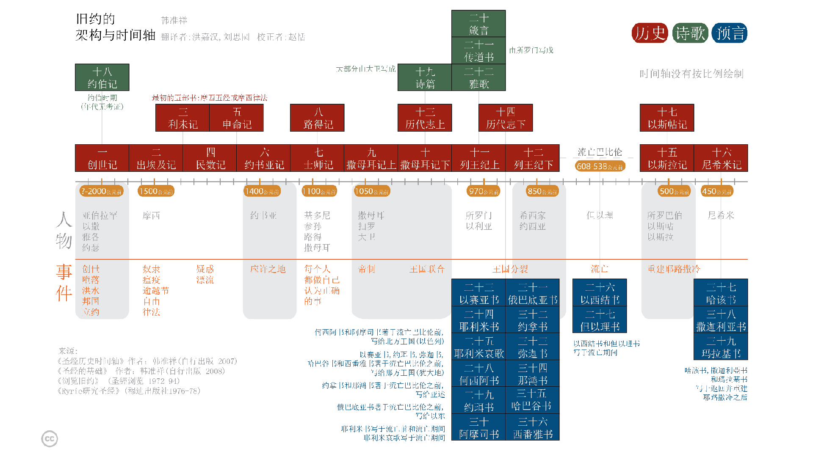
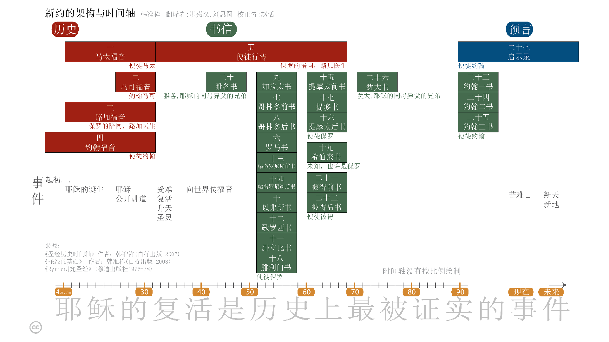

* 前言
* 简介
* 非线性阅读法
* 开始
* 每日阅读之重要性
* 圣经浏览
* 圣经导读：章与节
{:toc}

# 前言
大多数的人，在初次阅读圣经时，就像他们在阅读一般书籍一样，从第一章开始，依序逐篇阅读到最后一页。然而，这样却很容易导致挫折感。因为，当人们循序阅读圣经时，这种方法并未能促进他们对于圣经的理解。因此，这本《圣经要义》导读，则采用另一种「非循序」的方式，来研读圣经中的各卷经文。如此，则圣经的整体轮廓就更容易彰显出来了。

# 简介
各位好。本课程是为每一位想要学习成为耶稣追随者是什么意义的人设计的。许多人发现想要得到这样的知识必须从读圣经开始，但是他们却被某些因素阻碍（例如：圣经篇幅太冗长、不知从何处开始、或者曾经阅读过，但是却无法了解其中的含意等因素，而感到灰心与气𫗪）。

这本自学导读，能够帮助您找到您所想要探索的答案。它将带您通过快速阅读圣经的某些经卷而让您"全景"了解成为耶稣追最者的含义，以及加强对圣经的了解 -- 这也正是这本手册对那些成为耶稣追随者发挥功用之处。而这些都是有心为了达到最好的效果，希望在未来几周内，您能安排每天约三十分钟的时间，用来研读这份导读与圣经。

本课程包含两个部分。第一部分涵盖基础阅读，大约需要两周的时间就可完成。第二部分，"深度阅读"需要另外5周时间每天阅读。这样的学习列举出了理解圣经的基础要义和成为基督信徒的含义。

当您完成这本课程，您将会全副装备，充满能力，兴致高昂的继续研读圣经。

# 非线性阅读法
多数人在第一次阅读圣经时，就跟阅读其他一般书籍一样，从头至尾，依序阅读。

然而，当您用这种线性方式阅读圣经，并不利于您有效的理解，反而会造成挫败感。 这本导读课程，采用一种非线性阅读的方式阅读圣经。这样会帮助您读圣经的时候更有效了解圣经的全貌。而随著您每天的阅读进度，您也将更加了解圣经的内涵。

# 开始
首先您需要准备一本圣经、一枝铅笔或萤光笔用来标示重点。

刚开始学习时，您也许不需要一本具有注释版的圣经。但是从长远著想，为了配合这本导读，而去购买拥有一本具有注释版的圣经，还是有许多好处的。如果中文是您的母语[^1]，则购买"和合本"或"现代中文译本"是很好的选择。但是，应该避免选购"意译版"。（意译版对于希腊或希伯来文的原始字义，常有较广泛的诠释，这些可留待稍有基础以后再使用。）  

[^1]: fn 般而言，阅读母语版的圣经，最容易了解。因此，不妨采用您的母语译本的圣经。如果您具有双语能力，则选择您运用自如的语言版本即可。

# 每日阅读之重要性
安排特定时间，以便能完成每日该阅读的段落。

本课程约需每日二十至四十分钟专注而不受干扰的时段。每天阅读前，先向上帝祷告，祈求圣灵赐予悟性能够理解将要阅读的内容。

首先，快速的逐字阅读所选择的经文，（如果您使用的是附有注释说明的圣经，则暂时先别去阅读注释部分，要之，或者则仅先约略浏览一下即可）。如果您对某一节经文有兴趣，则先行标示下来，但是暂时不要停驻深加思索。（在本课程最后的部分，将说明如何深入思索圣经及如何有效使用注释版的圣经读本。）

每天阅读是非常重要的。因为漏过一两天，您将会忘了上次读到那儿，而且这也就很难让您对圣经的"全貌"产生出一种完整的认识。

# 圣经浏览
圣经包含了 希伯来文（旧约）及 希腊文（新约）两大部分经文。

希伯来经文，包含了三十九部书卷。它是大约在公元前1400至400年间，由许多位不同的作者撰写而成，前后历经约一千年。除了极小部分以外，全都用希伯来文撰写。在本导读的后端，有关希伯来经文的细节会详加说明。但是在前言这部分，我们可以概括来说，希伯来经文就在描述创造者 -- 上帝，赋予亚伯拉罕的后裔—以色列人一项特殊与独一无二的任务。而这项任务的目的，就是以色列人被赋予的"使命"，去告知世人有关创造者 -- 上帝的事迹。希伯来经文蕴含著许多有关弥赛亚（希伯来语，救主或拯救者之意）即将到来的参考段落。

{:.lead width="800" height="100" loading="lazy"}
旧约的架构与时间轴
{:.figcaption}

希腊经文包含二十七部书卷，是由许多位不同的作者，大约在公元40至90年间，历时约五十年才完成。这些希腊文的书卷叙述了造物主进入人类历史降世为人，应验了希伯来圣经记载弥赛亚（救世主）即将到来的事实。弥赛亚是亚伯拉罕的后裔，名为耶稣（Yeshua），英语译成 Jesus 。弥赛亚之希腊文为 Christos，由该字衍生出基督（Christ）之名号。现今，人们则将他的名字与头衔名号两者合并，而称之为耶稣基督。（Jesus (the) Christ）。
圣经架构与时间表

{:.lead width="800" height="100" loading="lazy"}
新约的架构与时间轴
{:.figcaption}

# 圣经导读：章与节
整部圣经的经文都分章节并加以编号，因此，您很容易找到特定章节的经文。

大多数的经卷都含有几个篇章（有些小经卷，只有单章或未分篇章）。章以下再分节，每一节通常包含一或两句经文。即使对圣经不熟悉的人，也都很可能曾经听过他人引用或见过像"约翰 3:16"这样的标记。这是指《约翰福音》第三章，第十六节的意思。以此为例，当您要查阅某段经文时，先从目录中去找寻书名，我们以《约翰书或称约翰福音》《约翰书》或《约翰福音》为例，它通常都在位于圣经后段的部分。当您找到《约翰福音》时，再翻过几页后，来到第三章。大多数的圣经读本，区分章别的字体比经文本身还要大，而节别的字体较小则直接放在经文之前面。但是，字体比经文稍小。请参阅下例。

《创世记》第一章第一节
11最初，上帝创造天地。

《约翰福音》第三章第十六节
16神爱世人，甚至将祂的独生子赐予世人，教信祂的不至灭亡，反得永生。

[基础篇](基础篇.md){:.heading.flip-title} --- 点击此处继续到下一部分。