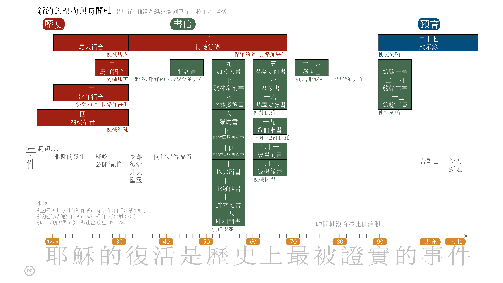

* 前言
* 簡介
* 非线性阅读法
* 開始
* 每日閱讀之重要性
* 聖經瀏覽
* 聖經導讀：章與節
* 
{:toc}

# 前言
大多數的人，在初次閱讀聖經時，就像他們在閱讀一般書籍一樣，從第一章開始，依序逐篇閱讀到最後一頁。然而，這樣卻很容易導致挫折感。因為，當人們循序閱讀聖經時，這種方法並未能促進他們對於聖經的理解。因此，這本《聖經要義》導讀，則採用另一種「非循序」的方式，來研讀聖經中的各卷經文。如此，則聖經的整體輪廓就更容易彰顯出來了。

# 簡介
各位好。本課程是為每一位想要學習成為耶穌追隨者是什麼意義的人設計的。許多人發現想要得到這樣的知識必須從讀聖經開始，但是他們卻被某些因素阻礙（例如：聖經篇幅太冗長、不知從何處開始、或者曾經閱讀過，但是卻無法瞭解其中的含意等因素，而感到灰心與氣餧）。

這本自學導讀，能夠幫助您找到您所想要探索的答案。它將帶您通過快速閱讀聖經的某些經卷而讓您"全景"瞭解成為耶穌追最者的含義，以及加強對聖經的瞭解 -- 這也正是這本手冊對那些成為耶穌追隨者發揮功用之處。而這些都是有心為了達到最好的效果，希望在未來幾週內，您能安排每天約三十分鐘的時間，用來研讀這份導讀與聖經。

本課程包含兩個部分。第一部分涵蓋基礎閱讀，大約需要兩週的時間就可完成。第二部分，"深度閱讀"需要另外5週時間每天閱讀。這樣的學習列舉出了理解聖經的基礎要義和成為基督信徒的含義。

當您完成這本課程，您將會全副裝備，充滿能力，興致高昂的繼續研讀聖經。

# 非线性阅读法
多數人在第一次閱讀聖經時，就跟閱讀其他一般書籍一樣，從頭至尾，依序閱讀。

然而，當您用這种線性方式閱讀聖經，並不利於您有效的理解，反而會造成挫敗感。 這本導讀課程，採用一種非线性阅读的方式閱讀聖經。這樣會幫助您讀聖經的時候更有效了解聖經的全貌。而隨著您每天的閱讀進度，您也將更加瞭解聖經的內涵。

# 開始
首先您需要準備一本聖經、一枝鉛筆或螢光筆用來標示重點。

剛開始學習時，您也許不需要一本具有註釋版的聖經。但是從長遠著想，為了配合這本導讀，而去購買擁有一本具有註釋版的聖經，還是有許多好處的。如果中文是您的母語[^1]，則購買"和合本"或"現代中文譯本"是很好的選擇。但是，應該避免選購"意譯版"。（意譯版對於希臘或希伯來文的原始字義，常有較廣泛的詮釋，這些可留待稍有基礎以後再使用。）

[^1]: fn 一般而言，閱讀母語版的聖經，最容易瞭解。因此，不妨採用您的母語譯本的聖經。如果您具有雙語能力，則選擇您運用自如的語言版本即可。

# 每日閱讀之重要性
安排特定時間，以便能完成每日該閱讀的段落。

本課程約需每日二十至四十分鐘專注而不受干擾的時段。每天閱讀前，先向上帝禱告，祈求聖靈賜予悟性能夠理解將要閱讀的內容。

首先，快速的逐字閱讀所選擇的經文，（如果您使用的是附有註釋說明的聖經，則暫時先別去閱讀註釋部分，要之，或者則僅先約略瀏覽一下即可）。如果您對某一節經文有興趣，則先行標示下來，但是暫時不要停駐深加思索。（在本課程最後的部分，將說明如何深入思索聖經及如何有效使用註釋版的聖經讀本。）

每天閱讀是非常重要的。因為漏過一兩天，您將會忘了上次讀到那兒，而且這也就很難讓您對聖經的"全貌"產生出一種完整的認識。

# 聖經瀏覽
聖經包含了 希伯來文（旧约）及 希臘文（新约）兩大部分經文。

希伯來經文，包含了三十九部書卷。它是大約在公元前1400至400年間，由許多位不同的作者撰寫而成，前後歷經約一千年。除了極小部分以外，全都用希伯來文撰寫。在本導讀的後端，有關希伯來经文的細節會詳加說明。但是在前言這部分，我們可以概括來說，希伯來經文就在描述創造者 -- 上帝，賦予亞伯拉罕的後裔—以色列人一項特殊與獨一無二的任務。而這項任務的目的，就是以色列人被賦予的"使命"，去告知世人有關創造者 -- 上帝的事蹟。希伯來經文蘊含著許多有關彌賽亞（希伯來語，救主或拯救者之意）即將到來的參考段落。

{:.lead width="800" height="100" loading="lazy"}
舊約的架構與時間軸
{:.figcaption}

希臘經文包含二十七部書卷，是由許多位不同的作者，大約在公元40至90年間，歷時約五十年才完成。这些希臘文的書卷叙述了造物主進入人類歷史降世為人，應驗了希伯來聖經記載彌賽亞（救世主）即將到來的事實。彌賽亞是亞伯拉罕的後裔，名為耶穌（Yeshua），英語譯成 Jesus 。彌賽亞之希臘文為 Christos，由該字衍生出基督（Christ）之名號。現今，人們則將他的名字與頭銜名號兩者合併，而稱之為耶穌基督。（Jesus (the) Christ）。

{:.lead width="800" height="100" loading="lazy"}
新約的架構與時間軸
{:.figcaption}

# 聖經導讀： 章與節
整部聖經的經文都分章節並加以編號，因此，您很容易找到特定章節的經文。

大多數的經卷都含有幾個篇章（有些小經卷，只有單章或未分篇章）。章以下再分節，每一節通常包含一或兩句經文。即使對聖經不熟悉的人，也都很可能曾經聽過他人引用或見過像"約翰 3:16"這樣的標記。這是指《約翰福音》第三章，第十六節的意思。以此為例，當您要查閱某段經文時，先從目錄中去找尋書名，我們以《約翰書或稱約翰福音》《約翰書》或《約翰福音》為例，它通常都在位于聖經後段的部分。當您找到《約翰福音》時，再翻過幾頁後，來到第三章。大多數的聖經讀本，區分章別的字體比經文本身還要大，而節別的字體较小則直接放在經文之前面。但是，字體比經文稍小。請參閱下例。

《創世記》第一章第一節
11最初，上帝創造天地。

《約翰福音》第三章第十六節
16神愛世人，甚至將祂的獨生子賜予世人，教信祂的不至滅亡，反得永生。

[基礎篇](基礎篇.md){:.heading.flip-title} --- 按此繼續到下一部分。